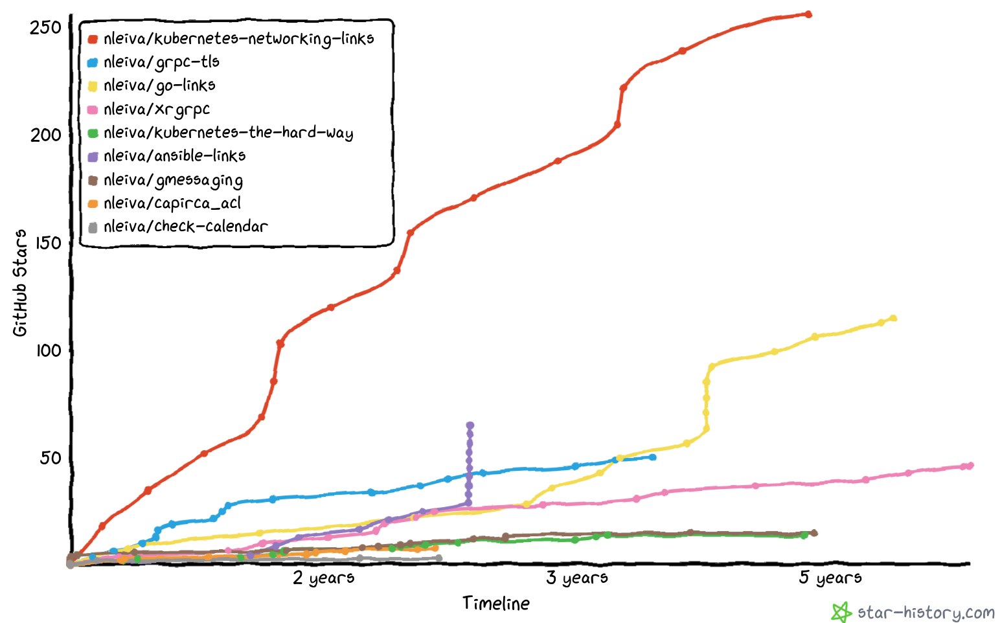

   
  <b>My Stuff</b> 

---

# Blog posts

Links to all my blog posts.
In the future I might add the markdown of each as well here.

## 2021
- [Mapping SAML attributes to Red Hat Ansible Automation Platform organizations and teams](https://www.ansible.com/blog/mapping-saml-attributes-to-red-hat-ansible-automation-platform-organizations-and-teams)
- [3 tips to make your GitHub profile stand out](https://nleiva.medium.com/3-tips-to-make-your-github-profile-stand-out-7b7a73c54572)
- [Network MOP's as automated workflows](https://www.ansible.com/blog/network-mops-as-automated-workflows)
- [5 ways to process JSON data in Ansible](https://opensource.com/article/21/4/process-json-data-ansible)
- [Monitoring your home lab devices in the cloud for free](https://nleiva.medium.com/monitoring-your-home-lab-devices-in-the-cloud-for-free-54c4d11ac471)

## 2020
- [Create an Ansible module for integrating your Google Calendar](https://opensource.com/article/20/10/ansible-module-go)
- [Integrate your calendar with Ansible to avoid schedule conflicts](https://opensource.com/article/20/10/calendar-ansible)
- [How to make the case for automation architecture: 5 ways to win investment](https://www.redhat.com/architect/automation-architecture)
- [Get Yourself GOing with Ansible](https://codeburst.io/get-yourself-going-with-ansible-60ca623bf4)
- [Ansible and Google Calendar Integration for Change Management](https://medium.com/swlh/ansible-and-google-calendar-integration-for-change-management-7c00553b3d5a)
- [Python and Ansible to automate a Network Security workflow](https://medium.com/swlh/python-and-ansible-to-automate-a-network-security-workflow-28b9a44660c6)

## 2019
- [Navigating the uncharted waters of SSL/TLS certificates and gRPC with Go](https://blog.gopheracademy.com/advent-2019/go-grps-and-tls/)
- [Practical guide to securing gRPC connections with Go and TLS — Part 2](https://itnext.io/practical-guide-to-securing-grpc-connections-with-go-and-tls-part-2-994ef93b8ea9)
- [Practical guide to securing gRPC connections with Go and TLS — Part 1](https://itnext.io/practical-guide-to-securing-grpc-connections-with-go-and-tls-part-1-f63058e9d6d1)
- [Running IPv6-enabled Docker Containers on AWS](https://medium.com/@nleiva/running-ipv6-enabled-docker-containers-on-aws-87e090ab0397)

## 2018
- [Kubernetes multi-cluster networking made simple](https://medium.com/@nleiva/kubernetes-multi-cluster-networking-made-simple-c8f26827813)
- [Documenting Network Automation Examples on DevNet Code Exchange](https://blogs.cisco.com/developer/documenting-network-automation)
- [Kubernetes Networking: Behind the scenes](https://medium.com/@nleiva/kubernetes-networking-behind-the-scenes-39a1ab1792bb)

## 2017
- [Validate the intent of network config changes](https://xrdocs.io/programmability/tutorials/2017-08-14-validate-the-intent-of-network-config-changes/)
- [Programming IOS-XR with gRPC and Go](https://xrdocs.io/programmability/tutorials/2017-08-04-programming-ios-xr-with-grpc-and-go/)

## 2016
- [Interconnecting vRouters with VPP](https://wiki.fd.io/view/VPP/Interconnecting_vRouters_with_VPP)

# GitHub stars

[**SOURCE**](https://star-history.t9t.io/#nleiva/kubernetes-networking-links&nleiva/grpc-tls&nleiva/go-links&nleiva/xrgrpc&nleiva/kubernetes-the-hard-way&nleiva/ansible-links&nleiva/gmessaging&nleiva/capirca_acl&nleiva/check-calendar)
